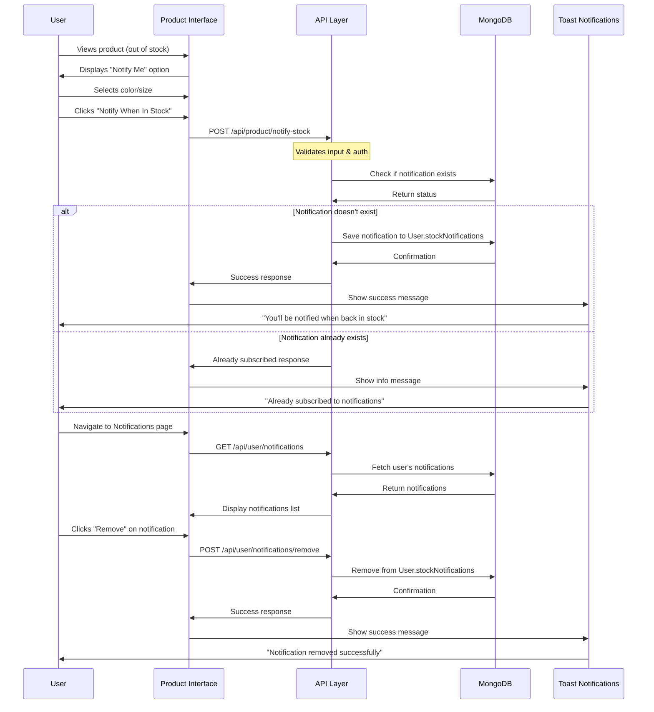
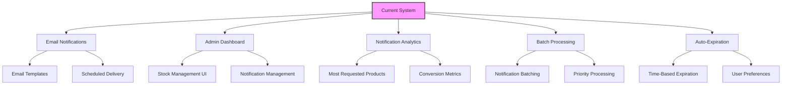

````markdown

# High-Level Architectural Diagram (Mermaid)

```mermaid
graph TD
    subgraph Frontend [Frontend (Next.js/React)]
        A1[Pages (app/)]
        A2[Components (components/)]
        A3[Context (context/)]
        A4[Sidebar/Topbar Filters]
        A5[Search Bar]
        A6[Seller Dashboard & Analytics]
        A7[Stock Notification UI]
        A8[Custom Design UI]
    end

    subgraph API Layer [API Layer (Next.js App Router)]
        B1[API Endpoints (app/api/)]
        B2[Stock Notification API]
        B3[Order Management API]
        B4[Product API]
        B5[User Data API]
        B6[Custom Design API]
        B7[API Metrics]
    end

    subgraph Backend [Backend Services]
        C1[Business Logic]
        C2[Database Models (models/)]
        C3[Config (config/)]
        C4[Inngest (Event Processing)]
        C5[Category Management]
        C6[Stock Management]
        C7[API Monitoring]
        C8[API Caching]
    end

    subgraph External Services [External Services]
        E1[Cloudinary (Image Storage)]
        E2[Razorpay (Payment Gateway)]
        E3[Clerk (Authentication)]
        E4[Toast Notifications]
    end

    subgraph Database [Database]
        D1[(MongoDB)]
    end

    %% Standard app flow
    A1 --> B1
    A2 --> A1
    A3 --> A1
    A4 --> A1
    A5 --> A1
    A6 --> A1
    A7 --> A1
    A8 --> A1
    B1 --> C1
    B2 --> C6
    B3 --> C1
    B4 --> C1
    B5 --> C1
    B6 --> C1
    B7 --> C7
    C1 --> C2
    C1 --> C3
    C1 --> C4
    C1 --> C5
    C6 --> C2
    C7 --> C8
    C1 --> E1
    C1 --> E2
    C1 --> E3
    C1 --> E4
    C6 --> E4
    C2 --> D1
    C5 --> D1
    C6 --> D1
    C8 -.-> D1

    %% Image upload flow
    A1 -. Upload Image .-> B1
    B1 -. Store Image .-> E1
    E1 -. Image URL .-> B1
    B1 -. Save Product (with imageUrl) .-> D1

    %% Payment flow
    A1 -. Checkout .-> B1
    B1 -. Payment .-> E2
    E2 -. Payment Status .-> B1
    B1 -. Save Order .-> D1

    %% Auth flow
    A1 -. Login/Register .-> E3
    E3 -. Auth Token .-> A1
    
    %% Stock notification flow
    A7 -. Subscribe .-> B2
    B2 -. Store Notification .-> D1
    A7 -. Check Stock .-> C6
    C6 -. Update UI .-> A7
    C6 -. User Notifications .-> E4
    
    %% API Performance
    B1 -. Metrics .-> C7
    C7 -. Optimization .-> C8
    C8 -. Fast Response .-> B1
```

**Note:**
- Product schema supports category, genderCategory, color/size/stock, and images.
- Seller dashboard and modal allow product management.
- Centralized category/gender management for consistency.
- Payment handled via Razorpay.
- Authentication via Clerk.
- Out-of-stock notification system allows users to subscribe for alerts when products are back in stock.
- User model includes stockNotifications array to track subscribed products.
- Real-time feedback with toast notifications for improved UX.

## Out-of-Stock Notification System Architecture

The out-of-stock notification system follows a user-centric approach to managing product availability alerts:

```mermaid
graph TD
    subgraph User Interface
        A1[Product Card]
        A2[Product Detail Page]
        A3[Notifications Page]
        A4[StockNotificationIcon]
    end

    subgraph API Endpoints
        B1[/api/product/notify-stock]
        B2[/api/user/notifications]
        B3[/api/user/notifications/remove]
    end

    subgraph Data Models
        C1[User.stockNotifications]
        C2[Product.color.stock]
    end

    subgraph Notification Flow
        D1[Check Stock Status]
        D2[Subscribe to Notification]
        D3[Store Subscription]
        D4[Manage Notifications]
        D5[Remove Notification]
    end

    A1 -- Out of Stock --> D1
    A2 -- Out of Stock --> D1
    D1 -- User Subscribes --> D2
    D2 -- API Request --> B1
    B1 -- Save --> C1
    A4 -- Fetch Count --> B2
    B2 -- Return --> C1
    A3 -- Display List --> B2
    A3 -- Remove --> B3
    B3 -- Update --> C1
    D4 -- User Manages --> D5
    D5 -- API Request --> B3
    C2 -- Checks --> D1
end
```

**System Components:**

1. **User Interface Layer:**
   - Product cards show "Out of Stock" overlay and "Notify Me" button
   - Product detail page displays stock status and notification subscription
   - Notification management page for viewing and removing subscriptions
   - Navbar notification icon with count badge

2. **API Endpoints:**
   - POST `/api/product/notify-stock` - Subscribe to notifications for a product
   - GET `/api/user/notifications` - Retrieve user's notification subscriptions
   - POST `/api/user/notifications/remove` - Remove a notification subscription

3. **Data Storage:**
   - User model extended with `stockNotifications` array
   - Each notification includes product details, selected options, and timestamp

4. **User Flow:**
   - User encounters out-of-stock product
   - User selects color/size and clicks "Notify When In Stock"
   - System stores notification preference with product details
   - User manages notifications through dedicated page
   - User receives toast notifications for feedback

This system enables seamless tracking of product availability preferences while maintaining data consistency through proper database schema design.

## Data Flow for Stock Notification Processing



This sequence diagram illustrates the complete user journey from discovering an out-of-stock product to managing notifications, showcasing the interaction between frontend components, API endpoints, database operations, and user feedback mechanisms.

## Database Schema for Stock Notifications

The notification system extends the existing User model with a new array field to store notification preferences:

```javascript
// models/User.js schema extension
const userSchema = new mongoose.Schema({
  // ... existing user fields
  stockNotifications: { 
    type: [Object], 
    default: [] 
  }
  // ... other fields
});
```

Each notification object in the array contains:

```javascript
{
  productId: String,        // MongoDB ID of the product
  productName: String,      // Product name at time of subscription
  color: String,            // Selected color
  size: String,             // Selected size (optional)
  date: Date,               // When the notification was requested
  productImage: String,     // URL to the product image
  price: Number,            // Product price at time of subscription
  brand: String,            // Product brand (optional)
  category: String          // Product category (optional)
}
```

This schema design offers several advantages:

1. **Data Denormalization**: Storing product details at subscription time preserves historical information even if the product changes
2. **Query Efficiency**: Fast retrieval of notifications without joins
3. **Flexibility**: Schema can easily accommodate new fields as requirements evolve
4. **User Context**: All notifications are associated directly with user accounts

The Stock Notification system leverages MongoDB's document model to efficiently store complex nested data within the user profile, enabling seamless notification management without requiring additional collections or complex relationships.

## Future Enhancements for Stock Notification System

The current implementation provides a solid foundation for stock notifications, with several potential enhancements planned for future iterations:



1. **Email Notifications**
   - Implement automated email delivery when products are restocked
   - Create customizable email templates with product images and details
   - Allow users to set notification preferences (email, in-app, or both)

2. **Admin Dashboard**
   - Create a management interface for sellers to view notification metrics
   - Enable manual triggering of notifications when inventory is updated
   - Provide insights on most-requested out-of-stock products

3. **Advanced Analytics**
   - Track conversion rates from notifications to purchases
   - Analyze patterns in product demand to inform inventory decisions
   - Identify high-demand products for prioritized restocking

4. **System Optimizations**
   - Implement notification expiration dates to manage database growth
   - Add batch processing for high-volume notification events
   - Create notification categories for better organization

These enhancements will further strengthen the notification system, improving both user experience and business intelligence capabilities.
