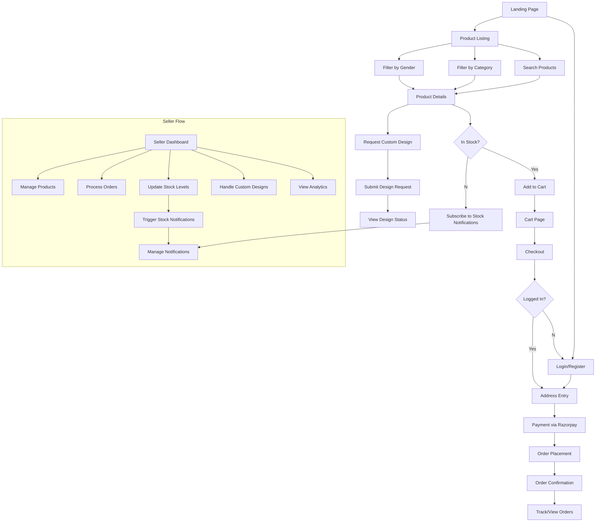

# User Flow Diagram

```mermaid
flowchart TD
    A[Landing Page] --> B[Product Listing]
    A --> Z[Login/Register]
    
    B --> B1[Search Products]
    B --> B2[Filter by Category]
    B --> B3[Filter by Gender]
    B1 --> C[Product Details]
    B2 --> C
    B3 --> C
    
    C --> D1{In Stock?}
    D1 --Yes--> D[Add to Cart]
    D1 --No--> N1[Subscribe to Stock Notifications]
    N1 --> N2[Manage Notifications]
    
    C --> P1[Request Custom Design]
    P1 --> P2[Submit Design Request]
    P2 --> P3[View Design Status]
    
    D --> E[Cart Page]
    E --> F[Checkout]
    F --> G{Logged In?}
    G --No--> Z
    Z --> H
    G --Yes--> H[Address Entry]
    H --> I[Payment via Razorpay]
    I --> J[Order Placement]
    J --> K[Order Confirmation]
    K --> L[Track/View Orders]
    
    subgraph Seller Flow
        S1[Seller Dashboard]
        S2[Manage Products]
        S3[Process Orders]
        S4[Update Stock Levels]
        S5[Handle Custom Designs]
        S6[View Analytics]
        
        S1 --> S2
        S1 --> S3
        S1 --> S4
        S1 --> S5
        S1 --> S6
        
        S4 --> N3[Trigger Stock Notifications]
        N3 --> N2
    end
```
